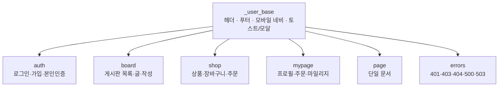
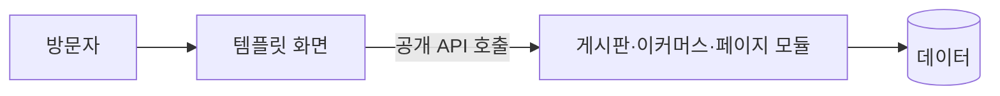

# Basic

**그누보드7 템플릿 · sirsoft-basic**
그누보드7 기본 사용자 템플릿

<!-- @generated:badges START — ext:docgen 이 갱신. 이 블록 안은 직접 수정하지 않는다 -->
<p align="center">
  
  
  
  
  
  
  
  
</p>
<!-- @generated:badges END -->

---

[소개](#소개) · [주요 기능](#주요-기능) · [동작 방식](#동작-방식) · [요구 사항](#요구-사항) · [설치](#설치) · [제공 컴포넌트](#제공-컴포넌트) · [사용 방법](#사용-방법) · [다른 확장과의 연동](#다른-확장과의-연동) · [문서](#문서) · [트러블슈팅](#트러블슈팅) · [변경 이력](#변경-이력) · [라이선스](#라이선스)

---

## 소개

<!-- @intent START -->
방문자가 보는 **사이트 전체 화면**을 담당하는 기본 사용자 템플릿입니다. 홈·게시판·상점·
마이페이지·로그인·오류 화면이 모두 여기 들어 있습니다.

그누보드7 에서 게시판이나 쇼핑몰 모듈은 데이터와 관리자 화면을 담당하고, **방문자에게 보이는
모습은 템플릿이 정합니다.** 그래서 상점이나 게시판의 디자인을 바꾸고 싶다면 그 모듈이 아니라
이 템플릿(또는 다른 사용자 템플릿)을 손봅니다.

다크 모드·반응형·다국어·다중 통화를 기본으로 지원하며, 상점 경로처럼 운영자가 환경설정에서
바꾸는 값은 화면과 주소에 자동으로 반영됩니다.

이 템플릿만으로는 동작하지 않습니다 — 게시판·이커머스·페이지 모듈과 주소 검색 플러그인이
함께 설치·활성화되어 있어야 합니다.
<!-- @intent END -->

## 주요 기능

<!-- @intent START -->
| 영역 | 설명 |
|---|---|
| 홈·공통 | 헤더·푸터·모바일 네비게이션, 통합 검색, 알림 센터, 다크/라이트 전환 |
| 인증 | 로그인·회원가입·비밀번호 찾기/재설정·본인인증 화면, 소셜 로그인 버튼 |
| 게시판 | 게시판 목록·글 목록·글 보기·글쓰기, 인기글, 게시판 유형별 표시 |
| 상점 | 상품 목록·카테고리·상품 상세·장바구니·주문서·주문 완료, 비회원 주문 조회와 재주문 |
| 마이페이지 | 프로필·비밀번호 변경·주문 내역·마일리지·찜·배송지·알림·내 게시글·문의 |
| 단일 문서 | 회사소개·약관 같은 페이지 표시 |
| 오류 화면 | 401·403·404·500·503·점검 중 |
| 다국어·다통화 | 언어 전환, 표시 통화 선택과 통화별 가격 표시 |
| 반응형·다크 모드 | 모바일/데스크톱 레이아웃 분기, 시스템 설정 연동 테마 |
<!-- @intent END -->

## 동작 방식

<!-- @intent START -->


모든 화면이 하나의 베이스를 물려받습니다. 헤더·푸터·모바일 메뉴와 알림 표시가 그 베이스에
있어, 사이트 전체의 공통 요소를 한 곳에서 바꿀 수 있습니다.



화면은 이 템플릿이 그리고 데이터는 모듈이 제공합니다. 그래서 템플릿을 바꿔도 게시글이나
주문 데이터는 그대로 남습니다.
<!-- @intent END -->

## 요구 사항

<!-- @generated:requirements START — ext:docgen 이 갱신. 이 블록 안은 직접 수정하지 않는다 -->
| 항목 | 값 |
|---|---|
| 그누보드7 코어 | `>=7.0.10` |
| PHP | `^8.2` |
| 의존 모듈 | `sirsoft-board` `>=1.0.0` |
| 의존 모듈 | `sirsoft-ecommerce` `>=1.1.0` |
| 의존 모듈 | `sirsoft-page` `>=1.1.0` |
| 의존 플러그인 | `sirsoft-daum_postcode` `>=1.0.0` |
<!-- @generated:requirements END -->

## 설치

<!-- @generated:install START — ext:docgen 이 갱신. 이 블록 안은 직접 수정하지 않는다 -->
```bash
# 번들 설치 (코어에 동봉된 소스에서 설치)
php artisan template:install sirsoft-basic

# 활성화
php artisan template:activate sirsoft-basic

# 업데이트 (번들 소스 기준 강제 반영)
php artisan template:update sirsoft-basic --force
```

저장소: https://github.com/gnuboard/g7-template-sirsoft-basic
<!-- @generated:install END -->

## 제공 컴포넌트

<!-- @generated:settings-summary START — ext:docgen 이 갱신. 이 블록 안은 직접 수정하지 않는다 -->
컴포넌트 79개 (루트: `src/components`).

| 분류 | 개수 |
|---|---|
| `basic` | 38개 |
| `composite` | 36개 |
| `layout` | 5개 |
<!-- @generated:settings-summary END -->

<!-- @intent START -->
위 개수는 이 템플릿이 화면을 그리는 데 쓰는 **부품**의 수입니다. 운영자가 직접 다룰 일은
없지만, 화면을 직접 손보거나 확장을 붙일 때는 **여기 있는 부품만 쓸 수 있습니다** — 목록에 없는
부품을 쓴 화면 조각은 이 템플릿에서 렌더되지 않습니다.

관리자 템플릿(`sirsoft-admin_basic`)과는 구성이 다릅니다. 표·필터·다국어 입력 같은 관리 도구가
없고, 대신 상품 카드·이미지 뷰어·수량 선택기·게시글 반응·모바일 메뉴·소셜 로그인처럼 **방문자
화면에 필요한 것들**이 있습니다.

전체 목록과 각 부품의 사용법은 [docs/components.md](docs/components.md) 에 있습니다.
<!-- @intent END -->

## 사용 방법

<!-- @intent START -->
**도입**: 템플릿을 설치·활성화하면 사이트의 방문자 화면이 이 템플릿으로 바뀝니다. 게시판·
이커머스·페이지 모듈과 주소 검색 플러그인이 함께 활성화되어 있어야 모든 화면이 정상 동작합니다 —
예를 들어 이커머스가 없으면 상점 메뉴로 들어갔을 때 데이터를 받지 못합니다.

**상점 주소 바꾸기**: 이커머스 환경설정에서 상점 경로를 바꾸면(`shop` → `store`) 이 템플릿의
상점 화면 주소도 함께 바뀝니다. 상점을 사이트 첫 화면으로 쓰려면 같은 설정에서 "경로 없음"
으로 두면 `/products` 처럼 최상위 주소가 됩니다. 템플릿을 고칠 필요가 없습니다.

**색상·문구 손보기**: 화면 구성은 레이아웃 파일(JSON)이 정하고 부품 모양은 컴포넌트가
정합니다. 레이아웃만 고치는 변경(문구·배치·표시 항목)은 다시 빌드할 필요 없이
`php artisan template:update sirsoft-basic --force` 로 반영됩니다.

**다른 템플릿으로 교체**: 이 템플릿은 화면만 담당하므로, 다른 사용자 템플릿으로 바꿔도
게시글·주문·회원 데이터는 그대로입니다.
<!-- @intent END -->

## 다른 확장과의 연동

<!-- @generated:integrations START — ext:docgen 이 갱신. 이 블록 안은 직접 수정하지 않는다 -->
**이 확장이 의존하는 확장**

| 확장 | 유형 | 버전 제약 | 번들 |
|---|---|---|---|
| `sirsoft-board` | 모듈 | `>=1.0.0` | ✅ |
| `sirsoft-ecommerce` | 모듈 | `>=1.1.0` | ✅ |
| `sirsoft-page` | 모듈 | `>=1.1.0` | ✅ |
| `sirsoft-daum_postcode` | 플러그인 | `>=1.0.0` | ✅ |

**이 확장에 의존하는 확장** (이 확장을 비활성화하면 함께 영향을 받습니다)

없음.
<!-- @generated:integrations END -->

## 문서

<!-- @generated:docs-index START — ext:docgen 이 갱신. 이 블록 안은 직접 수정하지 않는다 -->
| 문서 | 내용 | 상태 |
|---|---|---|
| [docs/README.md](docs/README.md) | 문서 통합 목차와 실측 집계 | ✅ |
| [docs/architecture.md](docs/architecture.md) | 설계 의도·계층 지도·디렉토리 맵 | ✅ |
| [docs/components.md](docs/components.md) | 템플릿이 제공하는 컴포넌트 | ✅ |
| [docs/layouts.md](docs/layouts.md) | 레이아웃 목록과 라우트 매핑 | ✅ |
| [docs/handlers.md](docs/handlers.md) | 템플릿 전용 핸들러와 부트스트랩 | ✅ |
| [docs/editor-spec.md](docs/editor-spec.md) | 레이아웃 편집기에 선언한 팔레트·컨트롤·샘플 데이터 | ✅ |
| [CHANGELOG.md](CHANGELOG.md) | 변경 이력 | ✅ |
<!-- @generated:docs-index END -->

## 트러블슈팅

<!-- @intent START -->
| 증상 | 원인 | 조치 |
|---|---|---|
| 상점 메뉴로 들어가면 화면이 비어 있음 | 이커머스 모듈이 비활성이거나 상품이 없음 | 모듈 활성화 여부와 상품 진열 상태를 확인합니다 |
| 상점 주소가 예전 경로 그대로 | 브라우저에 저장된 예전 링크 | 이 템플릿의 상점 주소는 이커머스 설정을 따릅니다. 메뉴를 통해 다시 들어가면 새 주소가 적용됩니다 |
| 게시판 메뉴는 보이는데 글 목록이 안 나옴 | 게시판 모듈이 비활성이거나 그 게시판의 접근 권한이 제한됨 | 모듈 활성화와 게시판별 권한 설정을 확인합니다 |
| 주소 검색 버튼이 없거나 눌러도 반응이 없음 | 주소 검색 플러그인이 비활성이거나 외부 접속이 차단됨 | 플러그인 활성화를 확인합니다. 검색을 불러오지 못하면 주소를 직접 입력할 수 있습니다 |
| 비회원으로 주문 조회를 했는데 이전 주문이 열림 | 브라우저에 남아 있던 조회 정보 | 이 템플릿은 조회 화면에 들어갈 때마다 남은 정보를 정리합니다. 계속 발생하면 브라우저 데이터를 지우고 다시 시도합니다 |
| 알림 메시지나 팝업이 뜨지 않음 | 그 화면이 공통 베이스를 쓰지 않음 | 직접 추가한 화면이라면 공통 베이스를 상속하도록 고칩니다 |
| 검색엔진 노출 화면에 일부 글자가 빠짐 | 새 부품이 쓰는 항목이 검색엔진용 렌더 설정에 없음 | `seo-config.json` 의 텍스트 항목 목록을 확인합니다 |
| 화면 일부의 여백·색이 어긋남 | 새로 쓴 스타일 클래스가 빌드된 CSS 에 없음 | 기존 화면에서 쓰이던 클래스인지 확인하고, 필요하면 템플릿을 다시 빌드합니다 |
<!-- @intent END -->

## 변경 이력

[CHANGELOG.md](CHANGELOG.md)

## 라이선스

MIT
